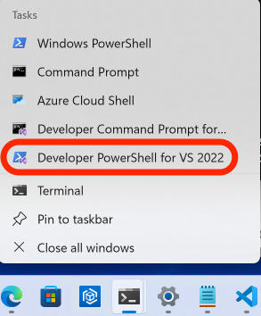

# Windows Build Instructions

This document provides instructions for building the project on Windows. It covers the installation of necessary dependencies, setting up the environment, and compiling the code.

## Prerequisites

- Install [Visual Studio](https://visualstudio.microsoft.com/) with the "Desktop development with C++" workload.
  
- In the Visual Studio Installer I selected three things (https://stackoverflow.com/questions/18711595/how-run-clang-from-command-line-on-windows):
  Desktop development with C++ from the Workload tab
  C++ Clang Compiler for Windows (13.0.1) from the Individual Components tab.
  C++ Clang-cl for v143 build tools (x64/x86) from the Individual Components tab.

- Install [Micromamba](https://mamba.readthedocs.io/en/latest/installation.html#micromamba).

- Use `Developer PowerShell for VS 2022` to have access to `cl` and `clang-cl`.

  

## Setting Up the Environment

1. Create and activate the Micromamba environment:

```powershell
micromamba env create --file environment-win.yml
micromamba activate b2-windows

# To remove the environment later:
# micromamba deactivate
# micromamba env remove -n b2-windows
```

2. Install additional dependencies:

- Replace `public virtual std::exception` with `public std::exception` in the boost archive exception header:

```powershell
# Find your micromamba environment path
$envPath = micromamba info | Select-String "envs directories" | ForEach-Object { ($_ -split ":", 2)[1].Trim() }
$boostFile = "$envPath\b2-windows\Library\include\boost\archive\archive_exception.hpp"
(Get-Content $boostFile).Replace('public virtual std::exception', 'public std::exception') | Set-Content $boostFile
```

- Set `CMAKE_PREFIX_PATH` environment variable to your micromamba environment:

```powershell
# Automatically detect micromamba environment path
$envPath = micromamba info | Select-String "envs directories" | ForEach-Object { ($_ -split ":", 2)[1].Trim() }
$env:CMAKE_PREFIX_PATH="$envPath\b2-windows\Library"
```

- Set `CC` and `CXX` environment variables to use clang:

```powershell
$env:CC='clang-cl'
$env:CXX='clang-cl'
```

- Install `build` package for building python wheels:

```powershell
pip install build
```

## Building the Project

1. Create a build directory and run CMake:

```powershell
# To build and test only the core:
cmake -DENABLE_UNIT_TESTING=ON -G Ninja -B bld .
cmake --build bld --target all --config Release
ctest --test-dir bld/core
```

2. Result of `ctest`

```powershell
(b2-windows) PS C:\users\bertini\projects\b2> ctest --test-dir bld/core
Test project C:/Users/bertini/projects/b2/bld/core
      Start  1: test_classes
 1/10 Test  #1: test_classes .....................   Passed    1.11 sec
      Start  2: test_blackbox
 2/10 Test  #2: test_blackbox ....................   Passed    1.05 sec
      Start  3: test_classic
 3/10 Test  #3: test_classic .....................   Passed    1.32 sec
      Start  4: test_endgames
 4/10 Test  #4: test_endgames ....................   Passed   29.87 sec
      Start  5: test_generating
 5/10 Test  #5: test_generating ..................   Passed    1.05 sec
      Start  6: test_nag_algorithms
 6/10 Test  #6: test_nag_algorithms ..............   Passed   50.97 sec
      Start  7: test_nag_datatypes
 7/10 Test  #7: test_nag_datatypes ...............   Passed    1.10 sec
      Start  8: test_pool
 8/10 Test  #8: test_pool ........................   Passed    1.11 sec
      Start  9: test_settings
 9/10 Test  #9: test_settings ....................   Passed    1.10 sec
      Start 10: test_tracking_basics
10/10 Test #10: test_tracking_basics .............***Failed    1.14 sec

90% tests passed, 1 tests failed out of 10

Total Test time (real) =  91.50 sec

The following tests FAILED:
         10 - test_tracking_basics (Failed)
Errors while running CTest
Output from these tests are in: C:/Users/bertini/projects/b2/bld/core/Testing/Temporary/LastTest.log
Use "--rerun-failed --output-on-failure" to re-run the failed cases verbosely.
(b2-windows) PS C:\users\bertini\projects\b2>
```

3. Install python bindings (after core is built):

```powershell
cmake --install bld --prefix $env:CMAKE_PREFIX_PATH

python -m build --wheel --no-isolation

pip install .\dist\pybertini-1.0.5-cp313-cp313-win_amd64.whl
```

** REMARK: There is an issue of .pyd file. Importing bertini in python gives an error. Please have a look **

## Changes to Note

* requires-python = ">= 3.13" -> requires-python = ">= 3.11"
* For Windows convention: uint -> unsigned int due to `error: unknown type name 'uint'; did you mean 'int'?`
* All the python bindings are commented out because core needs to be compiled first
* Generating dlls for windows binaries
* Add _WIN32 in #ifndef BERTINI_DISABLE_PRECISION_CHECKS otherwise it causes precision errors
* this->template Set(stepping); -> this->template Set<SteppingConfig>(stepping);
* this->template Set(newton); -> this->template Set<NewtonConfig>(newton);
* Remove #define BOOST_TEST_DYN_LINK 1
* const double threshold_clearance_d = 1e-15; -> const double threshold_clearance_d = 1e-14;
* use size_t index = 0; for tests
* remove scikit-build 

